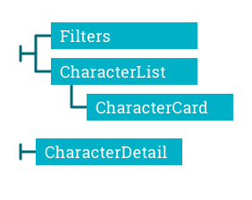

# Final evaluation Javascript

## Yanira Fernández Requena

This is the page I made for the **module 3: React final evaluation** for the **Adalab** front-end course.

We needed to make a website showing different Rick and Morty characters and some info about them.

### Main page:

1. Character list. Fetched from https://rickandmortyapi.com/api/character/
   - Icon showing character's species.
2. You can click a character to acces It's own page.
3. Text input for filtering character name.
   - Not cap sensitive.

### Character pages:

- Using **React router**.
- Shows extra Character information.
  - Icons showing character's species and status.
- Link to homepage.

### Page errors:

- Error showing that no character matches the user input.
- Error showing when trying to acces a non-existing character page.

### Loading

- A loading icon shows while fetching data from API.

### Local storage:

- User input is saved on local storage.

### Component structure

- Each component is located in a folder with it's name, together with component's **SCSS**.
- General styles are in stylesheet folder.

### Bonus:

- Added CSS styles.
- URL compatible.
- Characters are **ordered alphabetically**.

> This task was completed on 24/11/2020.

